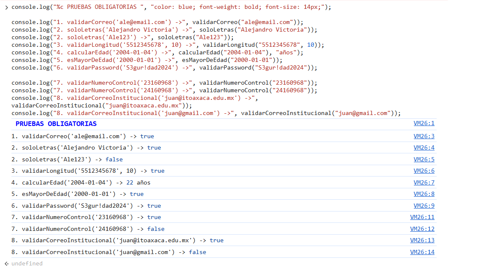

# Utilería JS
**Nombre:** Alejandro Jimenez Victoria
**Numero de control:** 23160968
**Utilería JS** es una librería ligera de JavaScript nativo (Vanilla JS) diseñada para simplificar y unificar las validaciones más comunes en formularios web. 

---

## Problema que resuelve

En el desarrollo de cualquier aplicación web es necesario validar los datos que ingresa el usuario en los formularios para evitar errores en el sistema, muchas veces se escribe en cada bloque el codigo requerido, por lo mismo se creo esta libreria en donde encapsula todo el codigo requerido para validar los datos de un formulario y unicamente se hace llamado a la libreria para obtener el resultado de la validacion.

## Instalación

Para usar **Utilería JS** en tu proyecto, simplemente enlaza el archivo `utileria.js` en tu documento HTML:

```html
<script src="js/utileria.js"></script>
```

## Estructura del Proyecto

```text
/utileria-js
├── README.md
├── index.html
├── login.html
├── css/
│   └── styles.css
├── js/
│   └── utileria.js
└── img/
    
```

---

## Uso y Documentación de Funciones

#### 1. `validarCorreo(correo) → boolean`
Valida si una cadena de texto tiene el formato correcto de email.
```javascript
const emailValido = validarCorreo("usuario@email.com"); // true
const emailInvalido = validarCorreo("usuario@email");   // false
```

#### 2. `soloLetras(texto) → boolean`
Solo permite letras mayúsculas, minúsculas, vocales acentuadas y espacios.
```javascript
const nombreValido = soloLetras("María José Núñez"); // true
const nombreInvalido = soloLetras("Juan123");        // false
```

#### 3. `validarLongitud(numero, maxLongitud) → boolean`
Valida que la longitud de un número (o string) no exceda el límite especificado.
```javascript
const telValido = validarLongitud("5512345678", 10);    // true
const telInvalido = validarLongitud("12345678901", 10); // false
```

#### 4. `calcularEdad(fechaNacimiento) → número entero`
Calcula la edad exacta en años a partir de una fecha de nacimiento (YYYY-MM-DD).
```javascript
// Si hoy es 2024 y naciste en 1990 y ya pasó tu cumpleaños
const miEdad = calcularEdad("1990-05-15"); // 34
```

#### 5. `esMayorDeEdad(fechaNacimiento) → boolean`
Valida si una persona tiene 18 años o más a partir de su fecha de nacimiento.
```javascript
const esMayor = esMayorDeEdad("2000-01-01"); // true
const esMenor = esMayorDeEdad("2015-10-20"); // false
```

#### 6. `validarPassword(password) → boolean`
Requiere que la contraseña tenga mínimo 8 caracteres, al menos 1 letra mayúscula, 1 minúscula, 1 número y 1 carácter especial.
```javascript
const passFuerte = validarPassword("S3gur!dad2024"); // true
const passDebil = validarPassword("clave123");       // false
```

#### 7. `validarNumeroControl(numeroControl) → boolean`
Verifica que el número de control escolar sea de 8 dígitos y corresponda a estudiantes de 7mo semestre en adelante (año de ingreso menor o igual a 23, o mayor/igual a 50).
```javascript
const alumnoValido = validarNumeroControl("23160968"); // true
const alumnoNuevo = validarNumeroControl("24160968");  // false
```

#### 8. `validarCorreoInstitucional(correo) → boolean`
Verifica que el correo electrónico pertenezca de manera obligatoria al dominio del instituto (`@itoaxaca.edu.mx`).
```javascript
const correoValido = validarCorreoInstitucional("juan@itoaxaca.edu.mx"); // true
const correoInvalido = validarCorreoInstitucional("juan@gmail.com");     // false
```

---

## Capturas de Pantalla

### Consola

*Figura 1: Resultados de las funciones de la librería en consola.*

### Index

*Figura 2: Vista de la página principal (Index).*

### Login

*Figura 3: Vista de la página de Login.*

### Modal

*Figura 4: Vista del Modal utilizado para alertas.*

---

## 🎥 Video Demostrativo


[Ver Video Demostrativo](https://youtu.be/f-RmoIFFko8)
